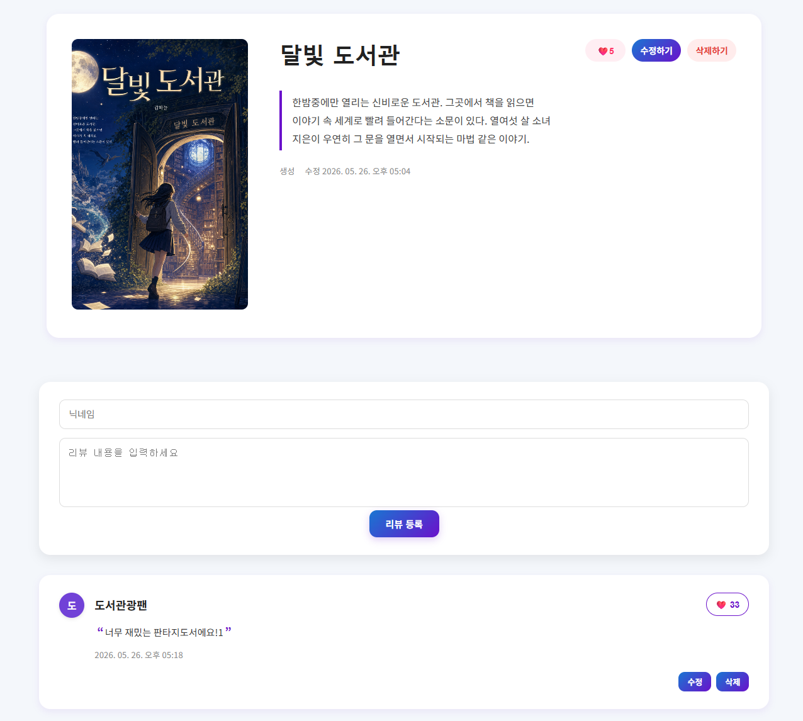

# 5차 미니 프로젝트 - 도서관리시스템 서버 개발

React, Spring Boot, OpenAI 이미지 생성 API를 활용한 도서 관리 웹 서비스입니다.

사용자는 도서 목록을 조회하고, 새 도서를 등록하거나 기존 도서를 수정할 수 있습니다. 또한 도서 내용 기반으로 AI 표지를 생성할 수 있으며, 도서별 리뷰 작성, 좋아요, 수정, 삭제 기능을 사용할 수 있습니다.

---

## 프로젝트 주요 기능

### 도서 기능

- 도서 목록 조회
- 도서 상세 조회
- 새 도서 등록
- 도서 수정
- 도서 삭제
- 도서 좋아요
- 최신순 / 이름순 / 좋아요순 정렬
- 등록된 도서 검색 (도서명, 작가명, 내용, 태그)
- 장르별 태그

### 리뷰 기능

- 도서별 리뷰 작성
- 리뷰 목록 조회
- 리뷰 수정
- 리뷰 삭제
- 리뷰 좋아요
- 홈 화면에서 인기 리뷰 확인

### AI 표지 생성 기능

- OpenAI API Key 입력
- 생성 모델 선택
- 품질 선택
- 도서 제목과 내용을 기반으로 AI 표지 생성
- 생성된 표지를 도서 데이터의 `coverImageUrl`에 저장

---

## 페이지 구성

### 1. 홈 페이지

- 월간 인기 도서 표시
- 인기 리뷰 표시
- 도서 또는 리뷰 클릭 시 상세 페이지로 이동
- 등록된 도서 검색

### 2. 도서 목록 페이지

- 전체 도서 목록 표시
- 최신순, 이름순, 좋아요순 정렬
- 도서별 자세히 보기 버튼 제공
- 장르별로 필터링하여 조회

### 3. 새 도서 등록 페이지

- 도서명 입력
- 작가 입력
- 태그 입력
- 책 내용 입력
- OpenAI API Key 입력
- AI 표지 생성
- 도서 등록

### 4. 책 자세히 보기 페이지

- 책 표지 이미지 표시
- 책 제목, 내용, 생성일 표시
- 도서 좋아요 기능
- 도서 수정 기능
- 도서 삭제 기능
- 해당 도서에 대한 리뷰 목록 표시
- 리뷰 작성, 수정, 삭제, 좋아요 기능 제공

---

## 기술 스택

### Frontend

- React
- Vite
- React Router DOM
- JavaScript
- CSS

### Backend

- Spring Boot
- Java
- Gradle
- H2 Database (파일 모드, `backend/data/bookdb.mv.db`)

### 외부 API

- OpenAI Image Generation API (`gpt-image-2`)

---

## 설치 및 실행 방법

### 1. 프로젝트 클론

```bash
git clone https://github.com/your-repo/project.git
cd project
```

### 2. 백엔드 실행

Spring Boot 서버를 실행합니다.

```bash
cd backend
./gradlew bootRun
```

Windows 환경에서는 아래 명령어를 사용합니다.

```bash
gradlew.bat bootRun
```

백엔드 서버는 아래 주소에서 실행됩니다.

```
http://localhost:8080
```

> 데이터는 `backend/data/bookdb.mv.db` (H2 파일 DB)에 저장됩니다.
> 초기 데이터가 필요한 경우 `backend/src/main/resources/db.json`을 참고하세요.

### 3. 프론트엔드 패키지 설치

루트 디렉토리에서 아래 명령어를 실행합니다.

```bash
npm install
```

### 4. React 개발 서버 실행

```bash
npm run dev
```

브라우저에서 안내되는 로컬 주소로 접속합니다.

```
http://localhost:5173
```

---

## 사용 가능한 명령어

### Frontend (루트 디렉토리에서 실행)

```bash
npm run dev
```

React 개발 서버를 실행합니다.

```bash
npm run build
```

배포용 파일을 생성합니다.

```bash
npm run lint
```

코드 문법 및 스타일 오류를 검사합니다.

```bash
npm run preview
```

빌드 결과를 로컬에서 미리 확인합니다.

### Backend (`backend` 디렉토리에서 실행)

```bash
./gradlew bootRun
```

Spring Boot 서버를 실행합니다.

```bash
./gradlew build
```

백엔드 빌드 파일을 생성합니다.

---

## 데이터 구조

### Book

| 필드명 | 타입 | 설명 |
|---|---|---|
| `id` | Long | 도서 고유 ID |
| `title` | String | 도서명 |
| `author` | String | 작가 |
| `tag` | Array | 도서 카테고리 태그 |
| `likes` | Number | 도서 좋아요 수 |
| `content` | String | 도서 내용 또는 요약 |
| `coverImageUrl` | String | 도서 표지 이미지 URL 또는 Data URL |
| `createdAt` | String | 도서 등록 시간 |
| `updatedAt` | String | 도서 수정 시간 |

### Review

| 필드명 | 타입 | 설명 |
|---|---|---|
| `id` | Long | 리뷰 고유 ID |
| `bookId` | Long | 리뷰가 연결된 도서 ID |
| `bookTitle` | String | 리뷰가 연결된 도서명 |
| `nickname` | String | 리뷰 작성자 닉네임 |
| `content` | String | 리뷰 내용 |
| `likes` | Number | 리뷰 좋아요 수 |
| `createdAt` | String | 리뷰 등록 시간 |
| `updatedAt` | String | 리뷰 수정 시간 |

---

## API 명세

기본 URL: `http://localhost:8080`

### 공통 오류 응답

```json
{
  "status": 404,
  "error": "NOT_FOUND",
  "message": "도서를 찾을 수 없습니다.",
  "path": "/books/999",
  "timestamp": "2026-05-22T10:00:00"
}
```

### 도서 API

| 기능 | Method | URL |
|---|---|---|
| 도서 목록 조회 | GET | `/books` |
| 도서 상세 조회 | GET | `/books/{id}` |
| 도서 등록 | POST | `/books` |
| 도서 수정 | PATCH | `/books/{id}` |
| AI 표지 이미지 저장 | PATCH | `/books/{id}/cover` |
| 도서 좋아요 증가 | PATCH | `/books/{id}/like` |
| 도서 삭제 | DELETE | `/books/{id}` |

#### 도서 목록 조회 Query Parameter

| 이름 | 타입 | 필수 여부 | 설명 |
|---|---|---|---|
| `keyword` | String | 선택 | 도서명, 작가명, 내용, 태그 검색어 |
| `sort` | String | 선택 | 정렬 기준. `latest`, `likes`, `title` |

### 리뷰 API

| 기능 | Method | URL |
|---|---|---|
| 리뷰 전체 조회 | GET | `/reviews` |
| 특정 도서 리뷰 조회 | GET | `/reviews?bookId={bookId}` |
| 리뷰 등록 | POST | `/books/{bookId}/reviews` |
| 리뷰 등록 (호환) | POST | `/reviews` |
| 리뷰 수정 | PATCH | `/reviews/{id}` |
| 리뷰 좋아요 증가 | PATCH | `/reviews/{id}/like` |
| 리뷰 삭제 | DELETE | `/reviews/{id}` |

---

## 라우팅 구조

| 페이지 | 경로 | 설명 |
|---|---|---|
| 홈 | `/` | 인기 도서와 인기 리뷰를 보여주는 페이지 |
| 도서 목록 | `/list` | 전체 도서 목록을 보여주는 페이지 |
| 새 도서 등록 | `/create` | 새 도서를 등록하는 페이지 |
| 책 자세히 보기 | `/detail/:id` | 특정 도서의 상세 정보와 리뷰를 보여주는 페이지 |

---

## 폴더 구조

```
AIVLE_MINIPROJECT_V2
├─ package.json
│
├─ backend
│  ├─ data
│  │  └─ bookdb.mv.db          # H2 파일 DB (런타임 생성)
│  ├─ src
│  │  └─ main
│  │     ├─ java               # Spring Boot 소스코드
│  │     └─ resources
│  │        ├─ application.yaml
│  │        └─ db.json         # 초기 데이터
│  ├─ build.gradle
│  ├─ gradlew
│  ├─ gradlew.bat
│  └─ settings.gradle
│
├─ frontend
│  ├─ assets
│  ├─ components
│  │  ├─ BookHomeItem.jsx
│  │  ├─ BookHomeList.jsx
│  │  ├─ Create.jsx
│  │  ├─ BookReportDetailItem.jsx
│  │  ├─ BookReportDetailList.jsx
│  │  ├─ BookReportHomeItem.jsx
│  │  ├─ BookReportHomeList.jsx
│  │  ├─ BookDetailEdit.jsx
│  │  ├─ api.js
│  │  └─ utils.js
│  ├─ pages
│  │  ├─ HomePage.jsx
│  │  ├─ ListPage.jsx
│  │  ├─ CreatePage.jsx
│  │  ├─ ReviewListPage.jsx
│  │  └─ DetailPage.jsx
│  ├─ public
│  ├─ App.css
│  ├─ App.jsx
│  ├─ main.jsx
│  └─ index.html
│
└─ README.md
```

---

## OpenAI 표지 생성 기능

새 도서 등록 페이지에서 사용자가 입력한 도서 제목과 책 내용을 바탕으로 OpenAI 이미지 생성 API를 호출합니다.

### 동작 흐름

1. 사용자가 도서명, 작가, 태그, 책 내용을 입력합니다.
2. OpenAI API Key를 입력합니다.
3. 생성 모델과 품질을 선택합니다.
4. 표지 생성 버튼을 클릭합니다.
5. Frontend에서 직접 OpenAI API로 이미지 생성 요청을 보냅니다.
6. 응답으로 받은 `b64_json`을 `data:image/png;base64,...` 형식의 Data URL로 변환합니다.
7. 변환한 Data URL을 `PATCH /books/{id}/cover`로 Spring Boot 서버에 전달하여 저장합니다.
8. 등록된 도서는 목록 페이지와 상세 페이지에서 확인할 수 있습니다.

### API Key 관련 주의사항

OpenAI API Key는 코드나 서버에 저장하지 않습니다.
보안을 위해 사용자가 화면에서 직접 입력하도록 구현했습니다.

---

## 주요 화면

### 홈 화면


### 도서 목록 화면


### 리뷰 목록 화면


### 새 도서 등록 화면


### 책 상세 화면



---

## 프로젝트 사용 흐름

1. 홈 페이지에서 인기 도서와 인기 리뷰를 확인합니다.
2. 도서 목록 페이지에서 전체 도서를 확인합니다.
3. 자세히 보기 버튼을 눌러 책 상세 페이지로 이동합니다.
4. 책 상세 페이지에서 좋아요를 누르거나 리뷰를 작성합니다.
5. 새 도서 등록 페이지에서 도서 정보를 입력합니다.
6. OpenAI API Key를 입력한 뒤 AI 표지를 생성합니다.
7. 도서를 등록하면 Spring Boot 서버에 저장됩니다.

---

## 프로젝트 목표

이 프로젝트의 목표는 React의 컴포넌트 구조, 상태 관리, REST API 통신, Spring Boot 기반 백엔드 개발, OpenAI API 활용을 실습하는 것입니다.

단순한 도서 CRUD 기능에서 나아가, AI 표지 생성과 리뷰 게시판 기능을 결합하여 사용자가 직접 도서를 등록하고 관리할 수 있는 풀스택 웹 서비스를 구현했습니다.